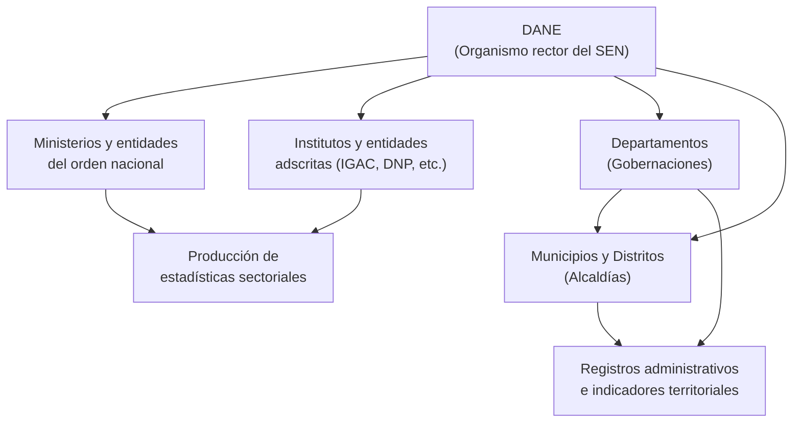

# Sesión 1 — Fundamentos: de los datos a la toma de decisiones

**Curso:** Diseño, construcción e interpretación de indicadores para la gestión territorial  
**Dirigido a:** Servidores públicos y contratistas de IDECA  
**Metodología:** DANE–EFET · Estándares OCDE / CEPAL / ONU

---

## Tabla de contenido

1. El hilo conductor: de los datos a la política pública
2. El Sistema Estadístico Nacional y el papel del DANE
   - Estructura del SEN
   - Funciones del DANE como organismo rector
   - Marco normativo
   - La Estrategia para el Fortalecimiento Estadístico Territorial (EFET)
3. Los principios fundamentales de las estadísticas oficiales (ONU)
4. Fuentes de información: registro administrativo y operación estadística
   - ¿Cómo se certifica una operación estadística?
5. De los datos a la información
   - ¿Qué hace que una medición sea buena?
   - La información como bien semipúblico
   - El riesgo de medirlo todo
6. Dato, métrica e indicador: ¿en qué se diferencian?
7. ¿Qué es un indicador?
   - Características básicas
   - Objetivos de un indicador
8. Bibliografía

---

## 1. El hilo conductor: de los datos a la política pública

Todo el curso gira alrededor de un ciclo de transformación de la información (DANE, 2009):

```
Dato  →  Información  →  Indicador  →  Línea base  →  Política pública
                                             ↑                  ↓
                                        Evaluación  ←  Monitoreo de resultados
```

Cada eslabón agrega valor al anterior. Los datos se organizan y contextualizan para producir información; la información se estructura en indicadores que permiten comparar y evaluar; los indicadores se articulan en una línea base que sirve como punto de referencia en el tiempo; y esa línea base alimenta el diseño e implementación de políticas públicas. Pero el ciclo no termina ahí: una vez en marcha la política, los indicadores se usan para monitorear su avance y medir sus resultados e impactos, información que a su vez retroalimenta el ciclo para ajustar o reformular la política. Es un proceso continuo, no lineal (Zall Kusek & Rist, 2004).

Esta cadena no opera en el vacío: existe un sistema institucional responsable de producirla con calidad, un marco normativo que la regula y principios internacionales que la orientan. Los siguientes apartados explican cada uno de esos componentes antes de llegar a la construcción del indicador en sí.

---

## 2. El Sistema Estadístico Nacional y el papel del DANE

Para que el ciclo dato → política pública funcione, alguien tiene que ser responsable de producir y garantizar la calidad de la información. En Colombia, esa responsabilidad recae en el **Sistema Estadístico Nacional (SEN)**: el conjunto de organismos, normas, recursos y procesos que producen, coordinan y difunden la información estadística oficial del país (DANE, 2009).

Su propósito es garantizar que la información producida por el Estado sea coherente, confiable y comparable a lo largo del tiempo y entre territorios.

### Estructura del SEN



El DANE actúa como eje articulador: establece las metodologías, coordina a los productores y garantiza que la información fluya de manera coherente entre los niveles nacional, departamental y municipal (Decreto 262, 2004).

### Funciones del DANE como organismo rector

- Establecer y estandarizar las metodologías estadísticas para el país.
- Coordinar la producción de estadísticas oficiales entre entidades del SEN.
- Garantizar los estándares de calidad de la información pública.
- Capacitar y asistir técnicamente a las entidades territoriales.
- Custodiar y difundir la información estadística oficial.

### Marco normativo

La producción estadística en Colombia no es discrecional: está regulada por un conjunto de normas que establecen obligaciones, responsabilidades y garantías tanto para los productores como para los usuarios de información.

| Norma | Qué regula |
|-------|-----------|
| **Constitución Política, Art. 15** | Protección de datos personales (habeas data) |
| **Constitución Política, Art. 20** | Derecho a informar y recibir información veraz |
| **Constitución Política, Art. 74** | Acceso a documentos públicos |
| **Ley 79 de 1993** | Secreto estadístico, obligaciones de suministro de información al DANE y responsabilidades de las entidades en la producción de estadísticas oficiales |
| **Decreto 262 de 2004** | Estatuto orgánico del DANE: define su misión como coordinador del SEN, sus funciones técnicas y competencias para establecer metodologías estadísticas |
| **Ley 152 de 1994** | Ley Orgánica del Plan de Desarrollo: establece qué indicadores deben incluir los planes de desarrollo nacional y territorial |
| **NTC GP 1000:2009** | Norma Técnica de Calidad en la Gestión Pública: exige a las entidades públicas colombianas implementar un sistema de gestión de calidad con indicadores de seguimiento, medición y mejora continua de sus procesos |

> El marco normativo se desarrolla en detalle en la Sesión 2, donde se analizará cómo cada norma genera obligaciones estadísticas concretas para las entidades territoriales.

### La Estrategia para el Fortalecimiento Estadístico Territorial (EFET)

La EFET es la apuesta del DANE por fortalecer las capacidades estadísticas de las entidades territoriales —departamentos, municipios y distritos— que producen o usan información para la gestión pública local (DANE, 2009).

Su metodología parte del diagnóstico de la situación estadística de cada entidad e incluye acompañamiento técnico para construir líneas base de indicadores, diseñar fichas técnicas y mejorar los procesos de recolección y uso de datos. Este curso sigue esa metodología.

---

## 3. Los principios fundamentales de las estadísticas oficiales (ONU)

El SEN no opera solo bajo normas colombianas: también está orientado por los **Principios Fundamentales de las Estadísticas Oficiales** adoptados por la Comisión de Estadística de las Naciones Unidas en 1994 y elevados a resolución de la Asamblea General en 2014 (A/RES/68/261). Estos principios son el referente internacional que da legitimidad a la producción estadística de los países miembros.

| # | Principio | Aplicación práctica |
|---|-----------|-------------------|
| 1 | **Pertinencia, imparcialidad y acceso igualitario** | Las estadísticas deben responder a necesidades reales y estar disponibles para todos en igualdad de condiciones |
| 2 | **Estándares profesionales** | Los métodos deben regirse por criterios científicos y éticos, no por presiones políticas |
| 3 | **Rendición de cuentas y transparencia** | Documentar fuentes, métodos y procedimientos de cada operación estadística |
| 4 | **Prevención del uso indebido** | Las estadísticas no pueden usarse para inducir conclusiones erróneas |
| 5 | **Fuentes estadísticas** | Las fuentes deben seleccionarse con criterios de calidad, costo y carga para los informantes |
| 6 | **Confidencialidad** | Los datos individuales recolectados para fines estadísticos son estrictamente confidenciales |
| 7 | **Marco legal** | La producción estadística debe estar respaldada por normas claras |
| 8 | **Coordinación nacional** | Los organismos estadísticos coordinan entre sí para garantizar coherencia |
| 9 | **Uso de estándares internacionales** | Facilita la comparabilidad entre países y regiones |
| 10 | **Cooperación internacional** | Los organismos estadísticos cooperan con organismos regionales e internacionales |

Para las entidades territoriales colombianas, los principios más críticos en la práctica cotidiana son la **imparcialidad** (producir datos sin sesgo político), la **confidencialidad** (proteger la información de los informantes) y la **transparencia** (documentar cómo y con qué fuentes se construyó cada indicador) (Naciones Unidas, 2014).

---

## 4. Fuentes de información: registro administrativo y operación estadística

Con el marco institucional claro, el siguiente paso es entender de dónde provienen los datos que se usan para construir indicadores. En Colombia, las dos fuentes principales son los registros administrativos y las operaciones estadísticas. Confundirlas lleva a errores en el diseño y la interpretación de indicadores (DANE, 2009).

Un **registro administrativo** es información que una entidad pública genera como subproducto del cumplimiento de sus funciones misionales. No se produce con propósito estadístico, sino para gestionar trámites, contratos, licencias, atenciones u otros procesos institucionales. Ejemplo: el Registro de Instrumentos Públicos que administra la Superintendencia de Notariado y Registro (SNR). Esa información existe porque la entidad necesita operar, no porque alguien haya diseñado una encuesta para medirla.

Una **operación estadística** es un proceso diseñado deliberadamente para producir información cuantitativa sobre un fenómeno, siguiendo una metodología rigurosa que garantiza representatividad, comparabilidad y calidad. Incluye encuestas, censos y estudios estadísticos. Ejemplo: el Censo Nacional de Población y Vivienda del DANE (DANE, 2009).

| | Registro administrativo | Operación estadística |
|--|------------------------|----------------------|
| **Propósito original** | Gestión institucional | Producción de información |
| **Diseño estadístico** | No | Sí |
| **Cobertura** | Depende del trámite | Definida por diseño muestral |
| **Control de calidad** | Variable | Sistemático |
| **Ejemplo** | Registro de Instrumentos Públicos — SNR | Censo Nacional de Población y Vivienda — DANE |

Ambas fuentes son válidas para construir indicadores, pero exigen tratamientos distintos. Un registro administrativo debe evaluarse cuidadosamente antes de usarse: puede tener subregistro, cambios en los criterios de captura entre periodos o coberturas incompletas. Una operación estadística ya incorpora ese control en su diseño, pero puede no estar disponible con la periodicidad que el indicador requiere.

> "Los registros administrativos constituyen una fuente de información valiosa para la producción estadística, siempre que se conozcan sus limitaciones y se apliquen los procedimientos adecuados para su aprovechamiento."  
> — DANE, *Guía para diseño, construcción e interpretación de indicadores* (2009)

### ¿Cómo se certifica una operación estadística?

El DANE administra el proceso de **Certificación de Operaciones Estadísticas**, mediante el cual una entidad del SEN puede acreditar que su operación cumple con los estándares de calidad para ser reconocida como estadística oficial. El proceso evalúa tres componentes:

1. **Diseño metodológico:** metodología documentada que define el objeto de medición, las variables, las fuentes, el marco muestral (si aplica) y los procedimientos de recolección y procesamiento.
2. **Gestión de la calidad:** controles en cada etapa del proceso estadístico — recolección, crítica, imputación, estimación y difusión — siguiendo los lineamientos del DANE.
3. **Documentación y metadatos:** información completa que permita a cualquier usuario entender qué mide la operación, cómo lo mide y cuáles son sus limitaciones.

Una operación certificada recibe el **Sello de Calidad Estadística del DANE** y queda incluida en el Inventario de Operaciones Estadísticas (IOEC), lo que la habilita como fuente oficial para la construcción de indicadores de política pública.

> Consultar operaciones certificadas: [Portal DANE — Certificación de Operaciones Estadísticas](https://www.dane.gov.co/index.php/sistema-estadistico-nacional-sen/calidad/certificacion-de-operaciones-estadisticas)

---

## 5. De los datos a la información

Los datos, por sí solos, no tienen valor para la gestión pública. Solo cuando se organizan, contextualizan e interpretan se convierten en **información**: un mensaje que reduce la incertidumbre y orienta la acción (DANE, 2009).

Esta distinción no es trivial. Una entidad puede acumular miles de registros administrativos y aun así carecer de información útil para tomar decisiones. La diferencia está en si esos registros han sido procesados con un propósito claro y una metodología rigurosa.

> "La información es el conjunto de datos que, una vez procesados, reducen la incertidumbre de quien toma decisiones."  
> — DANE, *Guía para diseño, construcción e interpretación de indicadores* (2009)

### ¿Qué hace que una medición sea buena?

El DANE (2009) establece cuatro características que toda medición debe cumplir para ser útil en la gestión territorial:

- **Pertinencia:** la variable medida es relevante para el problema que se quiere resolver. Medir por medir no aporta.
- **Precisión:** el método de recolección y procesamiento minimiza los errores y sesgos.
- **Oportunidad:** la información está disponible en el momento en que se necesita para decidir. Un dato correcto pero tardío puede ser inútil.
- **Economía:** el costo de producir la información es razonable frente al beneficio que genera.

### La información como bien semipúblico

A diferencia de los bienes privados, la información tiene dos propiedades económicas particulares que inciden directamente en la política pública (DANE, 2009):

1. **Costos marginales decrecientes:** a mayor volumen de información producida, menor es el costo de producir cada unidad adicional. Esto justifica la inversión en sistemas estadísticos centralizados como el SEN.
2. **No rivalidad en el consumo:** varias entidades pueden usar la misma información simultáneamente sin que una excluya a la otra. Una tasa de cobertura de vacunación calculada por el DANE puede ser usada al mismo tiempo por el Ministerio de Salud, las secretarías departamentales y los municipios.

Estas características explican por qué la asimetría de información entre entidades es un problema estructural en la política pública: quienes producen datos no siempre son quienes los necesitan, y quienes los necesitan no siempre saben que existen.

### El riesgo de medirlo todo

Una consecuencia frecuente de subestimar el costo de medir es la proliferación de indicadores irrelevantes. Producir muchos indicadores sin criterio de selección genera sobrecargas administrativas en las entidades productoras, dificulta identificar qué información es realmente estratégica y erosiona la confianza en los sistemas de información (Bonnefoy & Armijo, 2005, CEPAL/ILPES).

La clave está en elegir **variables adecuadas y suficientes**, con base en criterios de calidad y utilidad para quien toma decisiones (DANE, 2009).

---

## 6. Dato, métrica e indicador: ¿en qué se diferencian?

Con el contexto institucional y los conceptos de calidad claros, es posible precisar la diferencia entre tres términos que con frecuencia se usan como sinónimos pero que tienen naturalezas distintas (Pfenniger, 2004).

Un **dato** es una unidad de información bruta, sin contexto ni interpretación. Por sí solo no comunica nada: es el registro de un hecho observado (DANE, 2009). Ejemplo: *327 predios registrados en la localidad de Usaquén en 2024*.

Una **métrica** es el resultado de una operación matemática sobre datos. Organiza y resume, pero no necesariamente responde una pregunta de gestión (Bonnefoy & Armijo, 2005, CEPAL/ILPES). Ejemplo: *promedio de predios por hectárea en las localidades de Bogotá*.

Un **indicador** es una expresión cuantitativa o cualitativa que relaciona variables para describir el comportamiento de un fenómeno a lo largo del tiempo o frente a una referencia. Está diseñado para apoyar una decisión concreta (DANE, 2009). Ejemplo: *porcentaje de predios formalizados en Usaquén respecto al total de la localidad en 2024*.

| Concepto | Qué es | Ejemplo |
|----------|--------|---------|
| Dato | Registro bruto, sin contexto | 327 predios registrados en Usaquén, 2024 |
| Métrica | Cálculo sobre datos | Promedio de predios por hectárea en Bogotá |
| Indicador | Relación de variables orientada a una decisión | % de predios formalizados en Usaquén, 2024 |

Lo que distingue a un indicador de los demás es que está diseñado desde el principio para responder una pregunta de gestión: no describe simplemente lo que hay, sino que permite evaluar si una situación mejora, empeora o se mantiene frente a una meta o referencia.

> "Un indicador es una expresión cualitativa o cuantitativa observable que permite describir características, comportamientos o fenómenos de la realidad a través de la evolución de una variable o la relación entre variables."  
> — DANE, *Guía para diseño, construcción e interpretación de indicadores* (2009, p. 13)

---

## 7. ¿Qué es un indicador?

El DANE define un indicador como:

> "Una expresión cualitativa o cuantitativa observable que permite describir características, comportamientos o fenómenos de la realidad a través de la evolución de una variable o la relación entre variables, para comparar con referentes, y que entrega información relevante sobre el estado de un asunto."  
> — DANE, *Guía para diseño, construcción e interpretación de indicadores* (2009)

### Características básicas

Todo indicador debe cumplir tres condiciones (DANE, 2009):

- **Simplificación:** reduce la complejidad de un fenómeno a una expresión manejable, sin sacrificar su esencia.
- **Medición:** permite cuantificar o categorizar el fenómeno de manera replicable y verificable.
- **Comunicación:** transmite un mensaje claro a quien toma decisiones, sin requerir conocimiento técnico especializado para interpretarlo.

### Objetivos de un indicador

Un indicador bien construido cumple al menos uno de estos propósitos (DANE, 2009; Bonnefoy & Armijo, 2005, CEPAL/ILPES):

- Generar información para apoyar decisiones de política pública.
- Monitorear el cumplimiento de compromisos institucionales, normativos o de planeación.
- Cuantificar cambios en variables estratégicas a lo largo del tiempo.
- Hacer seguimiento al avance de planes, programas y proyectos.

---

## Bibliografía

- Bonnefoy, J. C., & Armijo, M. (2005). *Indicadores de desempeño en el sector público*. CEPAL/ILPES. Serie Manuales N.° 45. [Descargar PDF](https://repositorio.cepal.org/handle/11362/5611)
- Congreso de Colombia. (1993). *Ley 79 de 1993 — Normas sobre secreto estadístico*. [Ver norma](https://www.funcionpublica.gov.co/eva/gestornormativo/norma.php?i=1235)
- Congreso de Colombia. (1994). *Ley 152 de 1994 — Ley Orgánica del Plan de Desarrollo*. [Ver norma](https://www.funcionpublica.gov.co/eva/gestornormativo/norma.php?i=327)
- DANE. (2009). *Guía para diseño, construcción e interpretación de indicadores*. DANE-DIRPEN. [Descargar PDF](https://www.dane.gov.co/files/investigaciones/pib/nte/ibsc/Guia_construccion_interpretacion_indicadores.pdf)
- DANE. (2009). *Línea base de indicadores*. DANE-DIRPEN. [Descargar PDF](https://www.dane.gov.co/files/investigaciones/pib/nte/ibsc/Linea_base_indicadores.pdf)
- DANE. (s.f.). *Certificación de Operaciones Estadísticas*. [Ver portal](https://www.dane.gov.co/index.php/sistema-estadistico-nacional-sen/calidad/certificacion-de-operaciones-estadisticas)
- Naciones Unidas. (2014). *Principios fundamentales de las estadísticas oficiales*. Resolución A/RES/68/261. [Ver documento](https://unstats.un.org/unsd/dnss/gp/fundprinciples.aspx)
- Pfenniger, M. (2004). *Indicadores y estadísticas culturales: un breve repaso conceptual*. Portal Iberoamericano de Gestión Cultural. [Ver documento](https://www.gestioncultural.org/ficheros/BGC_AsocCulturales/mPfenniger.pdf)
- Presidencia de la República de Colombia. (2004). *Decreto 262 de 2004 — Estatuto orgánico del DANE*. [Ver norma](https://www.funcionpublica.gov.co/eva/gestornormativo/norma.php?i=12645)
- Zall Kusek, J., & Rist, R. C. (2004). *Ten steps to a results-based monitoring and evaluation system*. The World Bank. [Ver documento](https://openknowledge.worldbank.org/handle/10986/14926)
